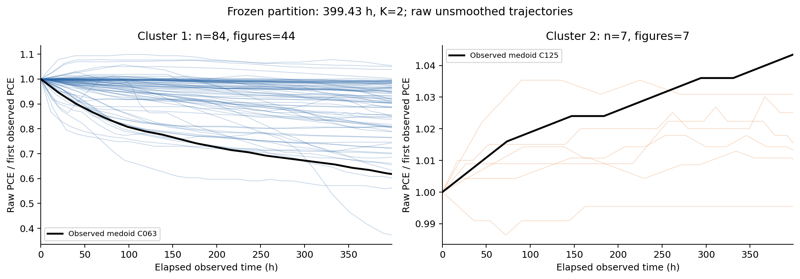
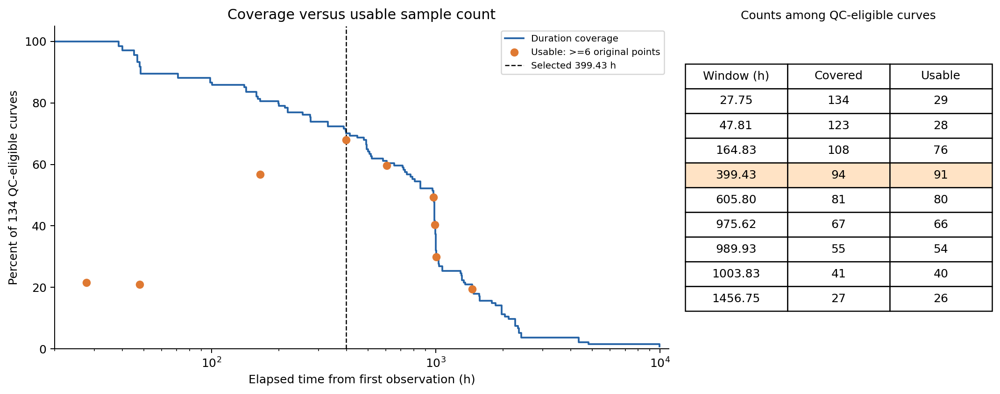
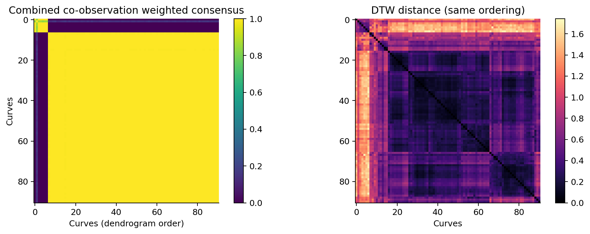
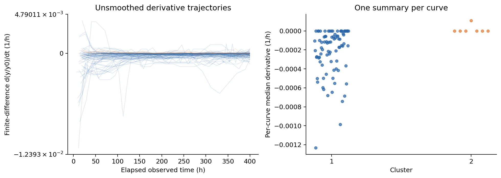
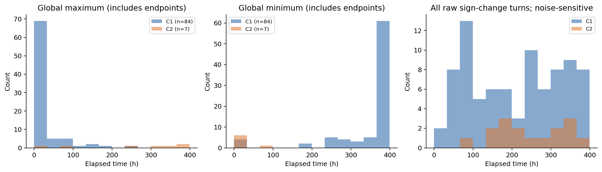
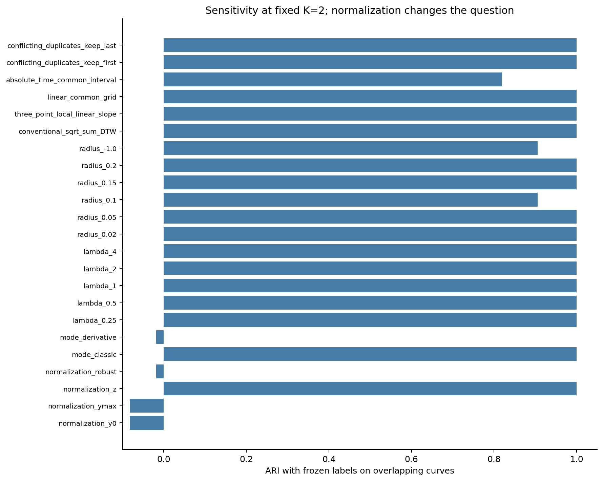

# 导数感知 DTW 无监督聚类：窗口探索与结果

数据：`method2/samples_test`。研究策略：原始 `02_derivative_dtw_clustering.md`。运行种子：20260906。源数据 SHA-256 检查全部一致，未修改原始文件。

## 1. 可以采用的结论

在本次 9 个候选时间窗口及明确的 QC、最低点数、稳定性评分规则下，推荐使用**自每条曲线首个观测点起 0–399.4283 h（约 400 h）作为探索性主窗口**。这是候选窗口中的推荐值，不能把 399.4283 h 解释为精确的物理临界时间，也不能直接写成所有样本的真实老化起点后 0–400 h。

主窗口纳入 **91 条曲线、46 个来源图**，约占 134 条 QC 合格曲线的 **67.9%**，占原始 218 条曲线的 **41.7%**。冻结参数为 **z-normalization、multivariate DTW、λ=4、20% 半径、average linkage、K=2**，两簇为 **84 / 7**；silhouette **0.6674**，Dunn **0.4440**。没有预设四类，也没有按目标形态调整参数。

**结论的实质限制：这是一种对扰动稳定、但依赖归一化与时间窗口的粗分组，尚不是跨处理方式成立的普适形态分类。** y/y0 或 y/ymax 与主分组的 ARI 为 −0.0822，说明保留相对衰减幅度后，算法回答了不同的问题。仅用 PCE 的 classic DTW 与加入导数后的主标签完全一致，不能据此声称导数提供了额外类别识别能力。较大的第一簇内部仍有幅度和局部形态差异。

图中仅为便于展示使用原始 y/y0；分类实际采用 z-normalization。线段连接原始采样点，仅窗口终点可能为线性插值。没有平滑、均值曲线或人工模板。两面板纵轴范围不同，避免把小幅变化误看成同量级的大幅变化。

## 2. 先做数据审计

共 218 个 CSV；134 条进入小时尺度 PCE 合格池，来自 66 个来源图。84 条暂不进入主分析，互斥排除原因如下。

| 原因 | 曲线数 |
| --- | --- |
| 时间与 PCE 轴均未确认 | 31 |
| 循环次数轴，不能当小时 | 17 |
| PCE 轴未确认（含功率/MPPT等） | 17 |
| 时间单位未知 | 6 |
| 同一时间戳存在不同 y | 6 |
| 时间未知且含非正 PCE/疑似未标定像素 | 4 |
| 极端时长待核查 | 2 |
| 轴未知且重复时间冲突 | 1 |

图片140 的两条记录含约 3604 万、3781 万小时的终点，并伴随百万小时尺度的负起点。依据 log10 时长的 median + 5×1.4826×MAD 规则隔离，未猜测正确单位或擅自修复。图片208 的曲线缺时间单位且含负响应值，也未当作有效 PCE 数据。图片35 明示 relative %，因此大于 100 的相对值不会被误删。天数轴显式乘 24 转为小时。

对重复时间采用保守原则：相同 x、相同 y 可去重；同 x 不同 y 的 6 条已确认小时 PCE 记录先排除，再以保留首次/末次的两种方式回纳作敏感性检验。主窗口回纳 4 条，原 91 条的标签均不变，ARI=1。完整逐条审计、原始点数、缺失值、时间间隔、源路径和原因见 [preprocessing_audit.csv](audit/preprocessing_audit.csv)。

## 3. 为什么推荐约 400 小时

以合格池每条曲线的实际观测时长生成覆盖比例窗口，再要求窗口内至少有 **6 个原始观测点**。只在已观测范围内对截断终点作线性插值，不外推、不把短曲线拉伸成完整时长。

| 候选窗口 h | 时长覆盖数 / 134 | 实际可用数 | 可用来源图数 | 可用占比 |
| --- | --- | --- | --- | --- |
| 27.75 | 134 | 29 | 14 | 21.6% |
| 47.81 | 123 | 28 | 16 | 20.9% |
| 164.83 | 108 | 76 | 40 | 56.7% |
| 399.43 | 94 | 91 | 46 | 67.9% |
| 605.80 | 81 | 80 | 39 | 59.7% |
| 975.62 | 67 | 66 | 34 | 49.3% |
| 989.93 | 55 | 54 | 28 | 40.3% |
| 1003.83 | 41 | 40 | 20 | 29.9% |
| 1456.75 | 27 | 26 | 12 | 19.4% |

全样本公共时长 27.75 h 虽然名义覆盖全部合格曲线，但长时实验在早期往往只记录两三个点，实际只有 29 条能用于此处设定的形态分析。47.81 h 同样只有 28 条有效曲线。399.43 h 的有效样本数最高，为 91；在更长窗口中，短时实验逐渐退出，稳定性或覆盖下降。因此“覆盖 100% 时长”和“能够分析 100% 样本”必须区分。

下表是每个窗口经过内部指标筛选、重采样与过度扭曲审计后最优的合格多变量候选，并非把不同样本群的 silhouette 直接当作可比较的测试准确率。

| 窗口 h | 最优候选归一化 | K | silhouette | 最弱扰动平均 ARI | 综合分 |
| --- | --- | --- | --- | --- | --- |
| 27.75 | ymax | 2 | 0.742 | 0.880 | 0.682 |
| 47.81 | z | 2 | 0.695 | 1.000 | 0.735 |
| 164.83 | z | 2 | 0.633 | 0.855 | 0.726 |
| 399.43 | z | 2 | 0.667 | 0.981 | 0.803 |
| 605.80 | z | 2 | 0.621 | 0.754 | 0.679 |
| 975.62 | y0 | 2 | 0.659 | 0.679 | 0.619 |
| 989.93 | y0 | 2 | 0.709 | 0.768 | 0.648 |
| 1003.83 | ymax | 3 | 0.664 | 0.809 | 0.645 |
| 1456.75 | y0 | 2 | 0.788 | 0.881 | 0.690 |

最终评分为 0.45×四种扰动中最弱的平均 ARI + 0.25×(silhouette+1)/2 + 0.10×Dunn/(1+Dunn) + 0.20×有效覆盖率 − 0.20×平均时间扭曲比例；过度扭曲另作惩罚和主结果排除。八组替代评分权重组合均仍选择相同的 399.43 h 候选，见 [selection_weight_sensitivity.csv](stability/selection_weight_sensitivity.csv)。权重是显式研究选择，不是具有统计最优性保证的公式。

不同窗口的样本组成变化明显：27.75 h 与主窗口没有共同有效样本；47.81 h 仅重叠 2 条，故不报告有意义的交集 ARI。固定主参数重新分析 164.83 h 和 605.80 h 时，分别在 63、78 条交集曲线上得到 ARI=0.408、0.475，说明窗口变化会实质改变分组。该比较仍同时受到窗口内归一化和拟合群体变化影响，不能视为纯粹的时间效应。

## 4. 参数搜索及对原策略的落实

实施策略 G1 的层次聚类分支；G2 的 DTW-SOM 是原文“如果实现”分支，本次未实现。四种归一化、classic/derivative/multivariate 三类距离、λ=[0.25,0.5,1,2,4]、半径=[2%,5%,10%,15%,20%]及 unrestricted 对照、average/complete/weighted 三种 linkage、K=2…10 都进入全量内部指标搜索。

共 **1,512 个距离矩阵，40,824 个聚类候选**。对其中 **105 个候选**做四种扰动各 50 次，共 **21,000 次候选级重采样聚类评估**；不是对全部 40,824 组都做 bootstrap。筛选按内部指标、占簇规模和不同分区执行，并确保每个 λ 有候选进入稳定性检验。之后在冻结的主距离和 linkage 上对 K=2…10 再逐一做四种扰动各 50 次（1,800 次评估，其中 K=2 是一致性复核），并补充 50 次来源图 bootstrap。

原始不等长序列直接进入 DTW。导数为 `np.diff(y_norm)/np.diff(t_hours)`，使用真实非等间隔 dt，附着于区间右端点；每个 DTW 通道采用一致的 N−1 支撑点。没有任何 Savitzky–Golay、移动均值、中位滤波、LOWESS、Gaussian、spline 或 wavelet 去噪。导数不额外标准化，因此 λ 的效果与每小时斜率尺度有关。

**需要明确披露的实现约定：**不等长序列使用相对样本下标带限制，即 |i/(n−1)−j/(m−1)| ≤ max(r, 0.5/(n−1)+0.5/(m−1))。这是对 Sakoe–Chiba 带的明确适配；离散采样会扩大最小可行带宽，不等同于物理时间相差不超过 rT。先求最小平方局部代价和的路径，再以 sqrt(代价和/路径长度) 作为主距离，减少点数不同导致的累积尺度差异；它不是寻找平均代价最小的路径。传统 sqrt(代价和) 已作为冻结模型对照，得到相同标签，ARI=1，但没有为传统距离另做整个窗口搜索，故这一结论仅限当前冻结窗口和参数。

方法概念来源为 [Keogh & Pazzani 的 Derivative Dynamic Time Warping](https://www.cs.ucr.edu/~eamonn/sdm01.pdf)，这里的有限差分按用户策略实现，不宣称等同于该论文的导数估计式。average、complete、weighted 的距离更新依照 [SciPy linkage 官方说明](https://docs.scipy.org/doc/scipy/reference/generated/scipy.cluster.hierarchy.linkage.html)。具体公式、筛选顺序、随机化与例外处理见 [PROTOCOL.md](code/PROTOCOL.md) 及可复现代码。

## 5. K 的证据

以下在同一冻结距离矩阵和 average linkage 下比较 K=2…10，所有行均有四种扰动各 50 次。

| K | silhouette | Dunn | 最小簇样本数 | 90% bootstrap ARI | 95% bootstrap ARI | 5%删点 ARI | 10%删点 ARI |
| --- | --- | --- | --- | --- | --- | --- | --- |
| 2 | 0.667 | 0.444 | 7 | 0.982 | 0.981 | 0.983 | 0.989 |
| 3 | 0.533 | 0.302 | 2 | 0.827 | 0.853 | 0.829 | 0.832 |
| 4 | 0.497 | 0.344 | 1 | 0.888 | 0.902 | 0.879 | 0.865 |
| 5 | 0.466 | 0.344 | 1 | 0.814 | 0.844 | 0.831 | 0.852 |
| 6 | 0.456 | 0.344 | 1 | 0.751 | 0.803 | 0.806 | 0.831 |
| 7 | 0.447 | 0.344 | 1 | 0.670 | 0.727 | 0.783 | 0.805 |
| 8 | 0.418 | 0.342 | 1 | 0.839 | 0.878 | 0.923 | 0.893 |
| 9 | 0.361 | 0.241 | 1 | 0.853 | 0.885 | 0.924 | 0.895 |
| 10 | 0.357 | 0.241 | 1 | 0.757 | 0.764 | 0.936 | 0.903 |

K=2 在这一模型中 silhouette 最高，重采样表现也较好。K≥3 出现仅 1–2 条的极小簇；K=4 的 silhouette 降至 0.497，且有单样本簇，不能据此宣称得到四个稳定总体类别。全量参数搜索保留这些结果，没有删除不符合预期的簇数。

## 6. 稳定性与共聚类

| 扰动 | 重复次数 | 平均 ARI | 2.5%–97.5% 重复分位范围 | 最小 ARI |
| --- | --- | --- | --- | --- |
| bootstrap90 | 50 | 0.9820 | 0.8571–1.0000 | 0.6454 |
| bootstrap95 | 50 | 0.9813 | 0.8308–1.0000 | 0.8303 |
| drop05 | 50 | 0.9830 | 0.9054–1.0000 | 0.9054 |
| drop10 | 50 | 0.9886 | 0.9054–1.0000 | 0.9054 |

90%/95% bootstrap 指有放回抽样的**抽样次数**占总样本量的比例，不是保留 90%/95% 不重复样本；ARI 在实际出现的唯一曲线上计算。表中分位范围是重复实验的经验分布，不是独立外部验证的置信区间。

删点保留两个端点以确保比较同一个窗口，只随机删除内部时间点。由于稀疏序列无法精确删除 5%，且最少删除 1 点，名义 5% 和 10% 实际平均删除总点数的 **6.74%** 和 **9.75%**。每次重新归一化、计算导数和 DTW。删点并未模拟响应值的测量误差或系统性数字化误差。

来源图为抽样单位的 50 次 bootstrap 平均 ARI 为 **0.9853**，经验 2.5%–97.5% 分位为 0.7891–1.0000。这缓解同图曲线相关性，但来源图不是经过核实的论文或独立器件标识。

四种扰动分别保存 C_ij、同簇次数、共同被观测次数。主展示矩阵把计数相加后按共同观测次数加权，并非四种矩阵的等权平均；不曾共同出现的对子在单个 bootstrap 矩阵中保留 NaN。

## 7. 参数冻结后的形态描述

| 簇 | 曲线数 | 来源图数 | 真实 medoid | 终点 y/y0 中位数 | 终点四分位范围 |
| --- | --- | --- | --- | --- | --- |
| 1 | 84 | 44 | C063 | 0.9126 | 0.8084–0.9697 |
| 2 | 7 | 7 | C125 | 1.0154 | 1.0117–1.0280 |

第一簇（84 条）总体以下降走势为主，同时包含较平坦曲线及早期上升后转降的轨迹，不能把它说成单一机制；其中 4 条终点仍高于初值。第二簇（7 条，来自 7 个不同图）以小幅上升、平台或轻微下降后恢复为主，其中 6 条终点高于初值；另一条 C044 终点约为初值的 99.55%。第二簇不是“全部单调上升”。其变化幅度普遍较小，z-normalization 会突出小幅形状变化，是否超过数字化/测量误差尚无法判断。

medoid 是簇内平均 DTW 距离最小的真实曲线：C063 和 C125。它代表归一化形状邻近性，不代表簇内衰减幅度的中位数；例如 C063 的衰减比第一簇终点中位数更明显。未生成均值或中位曲线冒充样本。未将结果强行对应策略所列的四个形态名称。

每簇全部未归一化原始 y、逐曲线原始值图库、导数分布、全局峰谷时间、原始局部转折时间和簇内距离均已导出。全局峰谷包含窗口边界；未平滑的局部转折可能来自量化台阶和数字化噪声，不能直接视为物理事件。

## 8. 导数贡献、归一化与时间扭曲

在主窗口固定 K=2 下，所有五个 λ 得到相同分组，且与 classic PCE DTW 的 ARI=1；加入导数仅使成对距离相对 classic 的相对变化中位数为 **1.38%**。λ=4 的综合分略高，但并未识别出不同标签，因此不应赋予其特殊物理意义。derivative-only 在相同设置下形成 90/1 分组，不能作为稳健的总体类别结论。

换 y/y0、y/ymax 或 robust 归一化后分组明显不同。y/y0 与 y/ymax 在同样 K=2、λ=4、r=20% 下得到 73/18 分组，更多反映相对衰减幅度；robust 在同样设置下产生 90/1。四种归一化的优劣因此必须结合“形状”与“幅度”的研究问题，而不能只挑一幅最像预期的图。

对各样本到本簇 medoid 的 89 条非自身路径检查：路径长度/较长序列长度的中位数 **1.048**、最大 **1.429**；平均物理时间位移为窗口的 **7.00%**（约 27.9 h）；各路径最大位移的 95 分位为 **22.85%**，全局最大为 **29.06%**（约 116.1 h）。路径审计覆盖样本到 medoid，不宣称检查了全部成对路径。

原始导数转折映射到同一个对方采样点的折叠比例平均 **4.72%**；有个别路径达到 **50%**，这些仅作为需要查看的数值风险标志。该指标不等同于已识别多个物理转折被合并。

将半径缩至 2% 或 5% 后标签仍完全一致（ARI=1），因此两簇分组不依赖 20% 才能产生；10% 与 unrestricted 均为 ARI=0.9054。半径 20% 在本次评分中获选，不能解释为必须允许那么大的时间扭曲。

三点局部线性斜率对照、传统累计 DTW 距离、线性公共网格对照均 ARI=1。公共网格仅作敏感性，间隔 21.02 h，不细于主窗口典型原始间隔 20.89 h。绝对时钟严格公共区间为 [53.30, 399.43] h，保留 83 条，交集 ARI=0.8195；时间起点处理仍有实质影响。

## 9. 建议写进研究结论的表述

“在经轴信息与采样质量筛选的数字化 PCE 曲线中，比较不同覆盖比例定义的时间窗口后，约 400 h 的观测时间窗口在有效样本覆盖与扰动稳定性之间表现较好。基于 z-normalized PCE 及真实有限差分导数的受限多变量 DTW 和 average-linkage 层次聚类，获得 84/7 的两簇粗结构。该结构对曲线重采样和随机删点较稳定，但对归一化及分析窗口敏感，且与相同条件下 PCE-only DTW 的分区一致。因此本结果支持条件性的探索分组，尚不足以确立四种普适老化形态、独立的物理机制类别或导数通道的额外识别收益。”

本次没有独立测试集、真实类别、统一应力条件或测量误差估计；内部指标与同一数据上的参数选择不能代替外部验证。约 400 h 的结论只覆盖所述入选群体，未对排除或时长不足的样本补造标签。

## 10. 文件导航

- [预处理审计](audit/preprocessing_audit.csv)、[逐窗口纳入/排除清单](audit/window_membership.csv)、[采样间隔](audit/sampling_intervals.csv)。
- `raw/`：原始 CSV、PNG、JSON 的来源副本及 SHA-256 清单；源文件本身未修改。
- `aligned/`：各窗口四种归一化长表，以及 NaN 补齐的 y/time 矩阵；NaN 是结构填充，未参与 DTW。
- `features/`：各窗口真实有限差分序列和最终描述性特征。
- `distance_matrices/`：全部 1,512 个 NPZ 矩阵及带 ID 的 [最终距离 CSV](distance_matrices/final_distance_matrix.csv)。
- [全量内部指标](clustering_results/internal_metrics_all.csv)、`labels_all_K2_to_K10.npz`、[最终标签](clustering_results/final_labels.csv)、[冻结参数](clustering_results/frozen_parameters.json)。
- [最终 K=2…10 标签](clustering_results/final_parameters_labels_K2_to_K10.csv)、[逐 K 稳定性](stability/final_K_sweep/K_comparison.csv)。
- [稳定性汇总](stability/stability_summary.csv)、[最终共聚类矩阵](stability/final_consensus_combined.csv)、[参数敏感性](stability/frozen_model_sensitivity.csv)。
- `clustering_results/representative_raw_curves/`：两条真实 medoid 的原始 CSV/PNG 与窗口文件。
- `figures/`：12 组主题图、6 页逐曲线图库；每图提供 PNG 与 SVG。
- [方法实施协议](code/PROTOCOL.md)、[代码说明与复现](code/REPRODUCE.md)。
