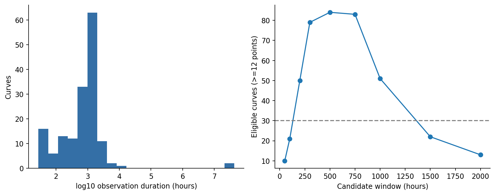
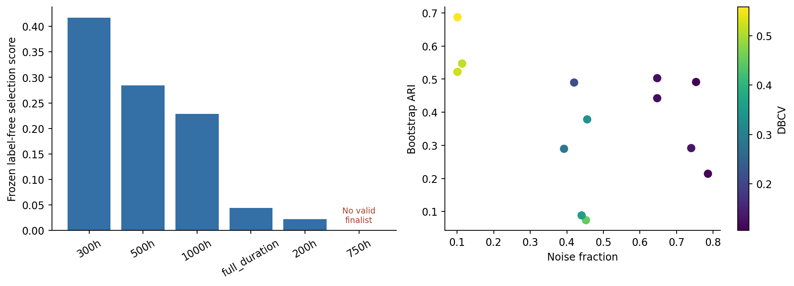
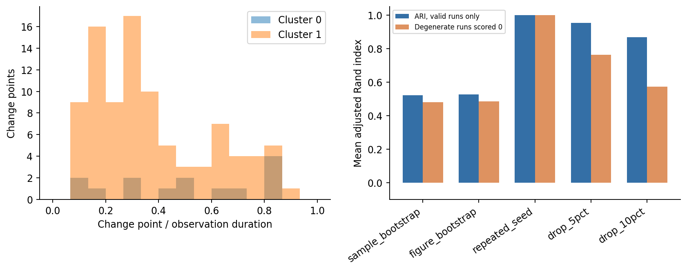

# 无监督变点检测 + 动力学特征 + HDBSCAN：研究结果

## 结论先行

- 在本次预先记录的无标签评分规则及搜索范围内，最佳候选是 **从首个有效观测点起 300 小时**，归一化为 **robust**，特征表示 **0.95**。
- 该候选纳入 **79 / 218** 条输入曲线，HDBSCAN 得到 **2 个簇**，另有 **8 条噪声曲线（10.1%）**。
- **这不是“数据天然只有 2 类”的证明。** 这是异质来源、不同实验条件和不同观察时长下的探索性分组；必须连同噪声、删点稳定性、归一化和算法敏感性解读。
- 样本 bootstrap ARI **0.522**；按图片分组 bootstrap ARI **0.527**；删去 5% / 10% 时间点 ARI **0.954 / 0.869**。
- 上述删点 ARI 只对仍产生至少两个非噪声簇的重复计算；5% / 10% 删点分别有 **20% / 34%** 的重复退化，不能把条件均值接近 1 解读为总体稳定。**当前没有找到足以作为稳定最终分类结论的 time window；300 小时是已测试候选中的探索性首选。**
- 至少一项主要扰动检验未达到 ARI 0.75，不足以认定为稳定、可重复的天然形态分类；此阈值只用于结论措辞。
- **本次最终结果不支持宣称存在四个稳定且可重复的簇；保持实际聚类结果，不强行调整为四类。**

## 1. 数据审计与适用范围

218 个 CSV 来自 99 张图片。它们是给定文件中的曲线数据，不能据此认定为实验仪器的原始读数。只读取 CSV 的 x/y 和元数据的坐标名称/单位；文件名中的材料、Control/Target 等内容仅用于溯源，不进入特征或参数选择。

元数据单位分布：{'hours': 157, 'unknown': 42, 'cycles': 17, 'days': 2}。已知小时和天的 159 条曲线中，3 条不足 12 个点，主搜索使用 156 条。天乘以 24 换算为小时；循环次数和单位不明的数据不混入小时主分析，而在敏感性分析中另行处理。未收到额外单位确认时，元数据保持为依据。

非有限值共 0 个；完全重复行共 0 个；不同输出共享时间戳的位置共 12 个。这些位置按时间戳取中位数，保留全部原始 CSV。负输出涉及 4 条曲线，记录异常标记而不因局部起伏删除点。x 起点的小负值保留在原副本；分析时间统一减去首个有效时间值，因此“0 小时”指首次观察，不一定是实验真正开始。

完整 QC：[qc_summary.csv](qc_summary.csv)。每条输入的最终状态：[all_218_sample_status.csv](final/all_218_sample_status.csv)。未知单位、非时间轴、点数不足、未覆盖窗口均有明确原因。

## 2. Time window 探索

候选 50、100、200、300、500、750、1000、1500、2000 小时；无需插值，仅选择持续到窗口末端且窗内至少 12 个原始点的曲线。队列不足 30 条的窗口仅报告覆盖率，不用于主模型选优。主比较为 200、300、500、750、1000 小时及完整时长。

| window_hours | n | coverage | eligible |
| --- | --- | --- | --- |
| 50 | 10 | 0.0641 | False |
| 100 | 21 | 0.1346 | False |
| 200 | 50 | 0.3205 | True |
| 300 | 79 | 0.5064 | True |
| 500 | 84 | 0.5385 | True |
| 750 | 83 | 0.5321 | True |
| 1000 | 51 | 0.3269 | True |
| 1500 | 22 | 0.1410 | False |
| 2000 | 13 | 0.0833 | False |

各窗口经 50 次 bootstrap 复核后的最佳候选：

| dataset | normalization | representation | n | n_clusters | noise_fraction | dbcv | bootstrap_ari | deletion_ari | normalization_ari | selection_score |
| --- | --- | --- | --- | --- | --- | --- | --- | --- | --- | --- |
| 300h | robust | 0.95 | 79 | 2 | 0.1013 | 0.5232 | 0.5220 | 0.4841 | -0.4485 | 0.4171 |
| 500h | max | 0.9 | 84 | 5 | 0.4524 | 0.4484 | 0.0736 | 0.4498 | -0.1218 | 0.2843 |
| 1000h | max | full | 51 | 2 | 0.6471 | 0.1221 | 0.5029 | -0.2520 | 0.0000 | 0.2288 |
| full_duration | robust | 0.9 | 154 | 2 | 0.7532 | 0.1060 | 0.4914 | -0.8147 | -1.0000 | 0.0439 |
| 200h | max | 0.99 | 50 | 2 | 0.4200 | 0.2141 | 0.4898 | -0.8000 | -1.0000 | 0.0216 |
| 750h | initial | 0.95 | 83 | 0 | 1.0000 | NA | NA | -1.0000 | -1.0000 | NA |

“最佳窗口”指本次评分最优，不代表已找到唯一物理时间尺度。完整时长模型将每条曲线的时间缩放为 0–1，用来比较形态；长短实验中相同相对进度并非相同老化时长。固定窗口不做外推，不在缺少真实末端点时构造末端值，实际最后一条观测可略早于窗口边界。覆盖率进入评分；另外保存共同样本上重拟合的窗口比较，以暴露样本组成差异。




## 3. 方法与参数冻结

`SMOOTHING = False`。主分析没有平滑、没有重采样、没有按形态删点。三种归一化分别为 y/y0、y/max(y)、(y−median(y))/(Q95−Q5)。归一化分母为零的方案视为不可用，不填造输出。变点检测内部只进行可逆仿射幅值缩放以校准惩罚，保留全部起伏。

变点搜索 PELT / Binary Segmentation / Window × l2 / linear / rbf × min_segment_fraction [0.03,0.05,0.08,0.10] × penalty_multiplier [0.5,1,2,3,5,8,10]，共 **252 组**；每组在 156 条主曲线上检验，并各做一次 5%/10% 删点探测。linear cost 的输入严格为 `[y, intercept=1, normalized_actual_time]`，不是把单列 y 误当回归模型。min_size=max(3,ceil(n×fraction)) 是点数约束；它不保证不规则采样下每段占相同物理时长。Window 宽度为至少 2×min_size 且约占样本数 20% 的偶数。

惩罚定义为 multiplier × 未分段 cost/n × log(n)，各 cost 在自己的量纲中校准。跨 cost 用共同的分段线性高斯 BIC 排名（每段 2 个回归参数，加变点位置参数），80% BIC 百分位 + 20% 变点位置 F1。最优变点参数：`{"id": "CP028", "algorithm": "pelt", "cost": "linear", "min_fraction": 0.03, "penalty": 0.5}`。每个算法/cost 家族保留一个最优参数用于敏感性分析；变点数没有固定。

稳定变点：每个窗口最终候选逐曲线随机删去 5%、10% 点，各 50 次；端点固定，实际删除点数四舍五入且至少 1 点。容许位置偏差为 max(总时长的 3%, 原始 median interval)，使用一对一匹配，输出支持率与位置误差。容差由采样分辨率决定，不含任何形态类别。零变点对零变点 F1 定义为 1；BIC 同时防止只按这个稳定性偏好无分段模型。

保留每段的 OLS/Theil–Sen 斜率、幅值、方差、时长、点数等。以左右边界的最低支持率作为段稳定度，选最多 4 段后按时间排序，不足 NaN 填充；全部分段另外保存。全局极值、正负差分、总变差、积分、恢复、转折及符号序列保留为连续或计数特征。恢复 amplitude 是最大累积谷后增幅；recovery ratio 以全局振幅为分母。主聚类中的斜率对相对时间定义；physical_slope 保存在分段描述中，不作为额外聚类输入。

缺失率 >40% 的列丢弃，余下缺失以训练样本中位数填补；常数列删除；RobustScaler 处理全部保留特征。PCA 比较保留方差 90/95/99% 和不降维。原特征和完整标准化矩阵均保存。长尾极值不剪裁；采样点数特征另做移除敏感性。

HDBSCAN 主搜索共 **4992 个组合**。min_cluster_size 在 [10,20,30,50,75,100] 中保留满足 2×size≤n 的值，小队列额外添加约 5%/10% 样本量且至少 5 的值；min_samples=[None,5,10,20]，eom/leaf，Euclidean/Manhattan。没有设置目标 K，allow_single_cluster 使用库默认 False，所以全噪声也可能意味着一个连续群体而非可分离多簇。

冻结 HDBSCAN 参数：`{"min_cluster_size": 5, "min_samples": NaN, "cluster_selection_method": "eom", "metric": "manhattan"}`。保留表示维数 5。DBCV=0.5232，silhouette=0.7239，DB=0.3976，CH=141.7944。silhouette 排除噪声；DB/CH 为欧氏质心指标，即使聚类使用 Manhattan，也只作附加描述。DBCV 调用 hdbscan 官方实现，Manhattan 对应 scipy 的 cityblock。

搜索采用分阶段设计，**并非所有 CP×窗口×归一化×HDBSCAN 的完全笛卡尔积穷举**。每个非退化 HDBSCAN 候选先做 5 次样本 bootstrap，每窗口×归一化最佳及全局前 6 个候选再做 50 次。先用 10+10 次删点评估段稳定度，最终各窗口重做 50+50 次并重拟合候选。最终评分：0.30 bootstrap ARI + 0.15 删点 ARI + 0.15 跨归一化 ARI + 0.10 非噪声比例 + 0.15 DBCV + 0.05 silhouette + 0.10 覆盖率。最终评分中的删点共 10 次用于选优，冻结结果再做 100 次完整敏感性。所有权重均写在 protocol.json 中，未以类别名称或 K=4 选参。

选优时，跨归一化或删点比较若退化到不足两个非噪声簇，按 −1 计入该项评分；因此 finalist 表的 normalization_ari / deletion_ari 是含退化惩罚的评分项。50 次 bootstrap 的均值则排除退化运行，另报告有效比例。标准 membership_probability 只是 HDBSCAN 内部成员强度，不是分类可重复性保证；例如小簇多条曲线成员强度接近 1，但 bootstrap Jaccard 仍较低。

## 4. 稳定性与敏感性

每次样本/图片 bootstrap 都重拟合缺失处理、scaler、PCA 和 HDBSCAN；带放回样本在共同唯一 ID 上比较。ARI 同时保存包括噪声和共同非噪声两个版本；两边任一不足两个非噪声簇时，ARI 为 NA，避免全噪声被误算为完美稳定。VI 以自然对数定义，越低越好；NA 比例同时报告。按图片 bootstrap 反映同图多曲线相关性。HDBSCAN 本身确定性运行；50 次 repeated-seed 指随机打乱输入行顺序，检验排序/并列距离效应。

| kind | repeats | ari_valid_fraction | ari_mean | ari_zero_for_degenerate_mean | ari_p05 | ari_p95 | vi_mean | noise_fraction_mean |
| --- | --- | --- | --- | --- | --- | --- | --- | --- |
| sample_bootstrap | 50 | 0.9200 | 0.5220 | 0.4803 | -0.0876 | 0.9783 | 0.6938 | 0.2894 |
| figure_bootstrap | 50 | 0.9200 | 0.5272 | 0.4851 | -0.1459 | 0.9966 | 0.6876 | 0.2813 |
| repeated_seed | 50 | 1.0000 | 1.0000 | 1.0000 | 1.0000 | 1.0000 | -0.0000 | 0.1013 |
| drop_5pct | 50 | 0.8000 | 0.9535 | 0.7628 | 0.8608 | 1.0000 | 0.2164 | 0.2780 |
| drop_10pct | 50 | 0.6600 | 0.8692 | 0.5737 | 0.1102 | 1.0000 | 0.3687 | 0.4205 |

逐簇 bootstrap Jaccard：

| cluster | n | sample_bootstrap_jaccard_mean | sample_bootstrap_jaccard_p05 | figure_bootstrap_jaccard_mean | figure_bootstrap_jaccard_p05 | repeated_seed_jaccard_mean | repeated_seed_jaccard_p05 |
| --- | --- | --- | --- | --- | --- | --- | --- |
| 0.0000 | 6.0000 | 0.4271 | 0.0000 | 0.4512 | 0.0000 | 1.0000 | 1.0000 |
| 1.0000 | 65.0000 | 0.6986 | 0.0237 | 0.6889 | 0.0000 | 1.0000 | 1.0000 |

归一化、重采样、算法及表示敏感性（同一冻结 HDBSCAN 参数）：

| kind | variant | n | n_clusters | noise_fraction | dbcv | ari | ari_assigned |
| --- | --- | --- | --- | --- | --- | --- | --- |
| normalization | initial | 79 | 2 | 0.3924 | 0.2855 | 0.1030 | NA |
| normalization | max | 79 | 0 | 1.0000 | NA | NA | NA |
| normalization | robust | 79 | 2 | 0.1013 | 0.5232 | 1.0000 | 1.0000 |
| change_point | cp_pelt_linear | 79 | 2 | 0.1013 | 0.5232 | 1.0000 | 1.0000 |
| change_point | cp_binseg_linear | 79 | 0 | 1.0000 | NA | NA | NA |
| change_point | cp_pelt_rbf | 79 | 2 | 0.1139 | 0.3261 | 0.8689 | 1.0000 |
| change_point | cp_pelt_l2 | 79 | 2 | 0.1013 | 0.5354 | 0.9214 | 1.0000 |
| change_point | cp_binseg_rbf | 79 | 0 | 1.0000 | NA | NA | NA |
| change_point | cp_binseg_l2 | 79 | 2 | 0.7595 | 0.0330 | -0.1558 | NA |
| change_point | cp_window_linear | 79 | 2 | 0.0886 | 0.5374 | 0.9750 | 1.0000 |
| change_point | cp_window_rbf | 79 | 2 | 0.0759 | 0.4191 | 0.9353 | 1.0000 |
| change_point | cp_window_l2 | 79 | 2 | 0.1013 | 0.4938 | 0.9214 | 1.0000 |
| representation | full | 79 | 2 | 0.1139 | 0.5144 | 0.9901 | 1.0000 |
| representation | 0.9 | 79 | 2 | 0.0506 | 0.4822 | 0.9213 | 1.0000 |
| representation | 0.95 | 79 | 2 | 0.1013 | 0.5232 | 1.0000 | 1.0000 |
| representation | 0.99 | 79 | 0 | 1.0000 | NA | NA | NA |
| linear_resampling | initial | 79 | 2 | 0.4304 | 0.3608 | 0.0581 | NA |
| linear_resampling | max | 79 | 2 | 0.4304 | 0.3907 | 0.0581 | NA |
| linear_resampling | robust | 79 | 2 | 0.0759 | 0.6419 | 0.8730 | 1.0000 |
| sampling_confound | exclude_point_count_features | 79 | 2 | 0.0886 | 0.3982 | 0.9902 | 1.0000 |

线性重采样只用于敏感性分析，网格步长不小于队列典型原始间隔，禁止外推。完整时长模型使用相对时间 common grid；固定窗口使用小时 common grid。重新采样可能减少原始极值/改变有限差分，这正是要检验的敏感性，而不是声称与原数据等价。

100 次时间点删除重新检测变点、提取特征并重拟合标准化/PCA/HDBSCAN。用于选四段的边界可靠度使用冻结的 100 次校准结果，并按时间容差映射到新变点，未在每次扰动内再嵌套 100 次可靠度校准。因此这是**条件于已估计边界可靠度的端到端检验**。变点方法替代和线性重采样的段可靠度使用 10+10 次，作为敏感性而非最终结论校准。bootstrap 也条件于冻结超参数，不等同于在每次 bootstrap 中重新做整个超参数搜索。

共同样本窗口比较：

| variant | n | n_clusters | noise_fraction | ari | ari_assigned |
| --- | --- | --- | --- | --- | --- |
| full_duration | 79 | 0 | 1.0000 | NA | NA |
| 200h | 42 | 0 | 1.0000 | NA | NA |
| 300h | 79 | 2 | 0.1013 | 1.0000 | 1.0000 |
| 500h | 68 | 0 | 1.0000 | NA | NA |
| 750h | 54 | 0 | 1.0000 | NA | NA |
| 1000h | 25 | 0 | 1.0000 | NA | NA |



## 5. 参数冻结后的形态解释

聚类后才根据真实 medoid 的 Theil–Sen 斜率符号解释。正负符号不作为类别训练目标；接近零的斜率可能由数字化精度引起，不强行赋予“快速/缓慢”的类别阈值。不同簇可共享相同斜率序列，簇内也可有多种序列。形态示例的存在并不等价于一个独立稳定簇。

| cluster | n |
| --- | --- |
| -1 | 8 |
| 0 | 6 |
| 1 | 65 |


### Noise：8 条

真实 medoid **S0197** 的自动分段序列：**decay → increase → decay**。各段 Theil–Sen 斜率（归一化输出/相对时间）：`[-2.7222, 3.1111, -3.8889]`。簇内 net change 中位数 -0.5145，recovery ratio 中位数 0.8302。


[最多10条真实代表曲线](final/noise/top10_real_curves.png) · [成员表](final/noise/members.csv)

该真实曲线呈现衰减后恢复，但 HDBSCAN 把它放在 noise 中；不能将这些噪声曲线另行命名为一个已识别的稳定恢复簇。

### Cluster 0：6 条

真实 medoid **S0099** 的自动分段序列：**increase → increase → decay**。各段 Theil–Sen 斜率（归一化输出/相对时间）：`[14.4195, 0.2747, -1.4831]`。簇内 net change 中位数 1.0799，recovery ratio 中位数 1.0000。


[最多10条真实代表曲线](final/cluster_0/top10_real_curves.png) · [成员表](final/cluster_0/members.csv)

### Cluster 1：65 条

真实 medoid **S0107** 的自动分段序列：**decay → decay**。各段 Theil–Sen 斜率（归一化输出/相对时间）：`[-2.5547, -0.6131]`。簇内 net change 中位数 -1.1354，recovery ratio 中位数 0.0000。


[最多10条真实代表曲线](final/cluster_1/top10_real_curves.png) · [成员表](final/cluster_1/members.csv)

这个 medoid 的早段衰减斜率绝对值约为晚段的 **4.17 倍**，是 rapid decay → slow decay 的真实示例；它不代表整个簇中所有曲线都有相同分段。

### 对研究问题的直接回答

1. **数据天然支持多少个 cluster？** 本次规则选出 2 簇及 8 个 noise；稳定性和敏感性如上，不能推断为数据天然唯一的类别数。
2. **是否出现 increase→decay、rapid decay→slow decay、decay→recovery？** 在自动分段符号序列中，increase→decay 有 16 条，decay→increase（恢复）有 9 条，连续衰减段有 52 条。这是聚类后描述计数，未用于选参。是否“快速→缓慢”须比较同条曲线的实际斜率大小，不能仅凭两个负号认定；所有数值在 all_segment_descriptors.csv。
3. **是否存在四个稳定且可重复的 cluster？** 本次最终方案没有建立这一结论。没有为了得到四类调参。

主搜索中共有 26 个参数组合出现四簇；这些组合的噪声比例为 51.2%–64.6%，5 次筛选 bootstrap ARI 最高仅 0.137。四簇候选已在参数冻结后另存 `sensitivity/four_cluster_candidates_posthoc.csv`，这些结果没有进入反向调参。

参数冻结后，又对全部 26 个四簇候选分别做了 **50 次 bootstrap**；平均 ARI 最高为 **0.202**。这是结论核验，不触发任何模型重选。其区间、有效比例以及重复出现四簇的频率均已保存。

## 6. 限制与可复现性

- 不同实验可能有不同温度、光照、湿度和测试条件；缺少统一应力条件，时间尺度不能直接解释为同一种动力学常数。
- 不同来源图片的数字化分辨率和已存在的数据加工未知。禁止的是本流程再做平滑，不代表上游数据必然未处理。
- 窗口筛选存在观察截止和存活偏差；完整时长存在时长混杂。共同样本复拟合和按图片 bootstrap 可暴露部分问题，无法消除它们。
- 156 条主曲线及若干固定窗口子集规模有限，广泛无监督调参仍可能产生选择偏差。没有独立确认集，得分用于探索性排序。
- 极值、总变差、最大有限差分对采样密度敏感；原始点数特征按策略保留，并额外做删除这些特征的诊断。
- 时序端点未参与随机删除，保持窗口及归一化基准，稳定性不代表对起点/终点不确定性的稳健性。
- 模型不强制一个簇，也不强制四簇；默认 HDBSCAN 可能把单个连续密度群整体判为 noise。
- 当前 Python/数值库环境在部分 PCA 矩阵乘法中发出 RuntimeWarning，日志保留。已验证全部聚类输入为有限值，并用独立 einsum 计算重构保存的 scaler/PCA 坐标，误差在 1e-9 容差内，避免仅靠忽略警告认定结果有效。

复现（需要安装 requirements-lock.txt 中的依赖）：

```bash
cd /Users/shunhao/Desktop/ML/method1/change_point_hdbscan_20260905
.venv/bin/python code/run_pipeline.py --stage all
.venv/bin/python code/verify_outputs.py
```

脚本使用 cache 断点续跑。彻底重跑请将代码和 strategy_original.md 复制到一个新目录，或将当前 cache 改名保留后运行；不要删除原始数据。来源和输出有 SHA-256 校验。

方法实现参考：[ruptures PELT](https://centre-borelli.github.io/ruptures-docs/user-guide/detection/pelt/)、[CostLinear](https://centre-borelli.github.io/ruptures-docs/user-guide/costs/costlinear/)、[Window](https://centre-borelli.github.io/ruptures-docs/user-guide/detection/window/)、[HDBSCAN API / DBCV](https://hdbscan.readthedocs.io/en/latest/api.html)。

## 7. 文件入口

- `code/`：完整 Python 分析与验证程序。
- `raw_input/`：CSV 与元数据原始副本；`cleaned_input/`：仅有限值/重复时间戳处理后数据。
- `window_inputs/`：不重采样的各窗口数据；`resampled_input/`：敏感性线性网格数据。
- `normalized_input/`：各主窗口三种归一化后的全部曲线，保留原始观测点。
- `features/`：全部窗口、归一化及可靠度重复次数的特征表。
- `search/`：252 组变点参数、逐曲线指标、全 HDBSCAN 搜索、候选复核、窗口覆盖率。
- `final/feature_table.csv`、`final/cluster_assignment.csv`、`final/standardized_features_no_pca.csv`：最终核心数据。
- `final/cluster_*/`：每簇全部 raw 曲线叠图、medoid 与最多 10 条真实代表曲线及 CSV。
- `stability/`：50+50 次变点、100 次删点、50 次样本/图片 bootstrap、50 次种子顺序检验。
- `sensitivity/`：方法/归一化/采样/窗口/队列/HDBSCAN 参数敏感性。
- `unsupervised_audit_log.json`、`protocol.json`、`checksums.sha256`：无标签与来源审计。
