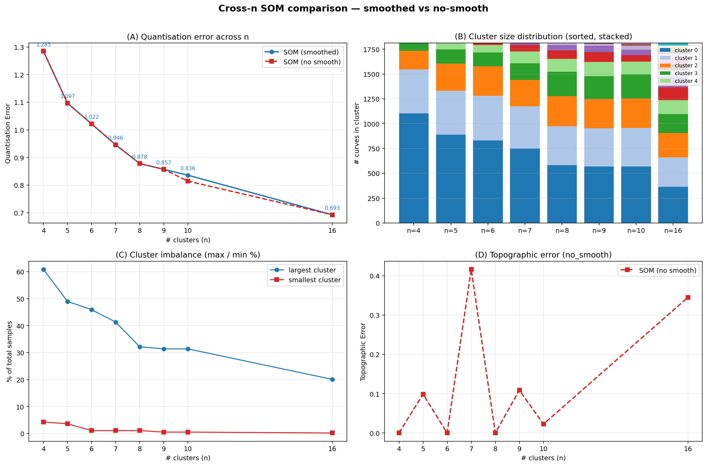
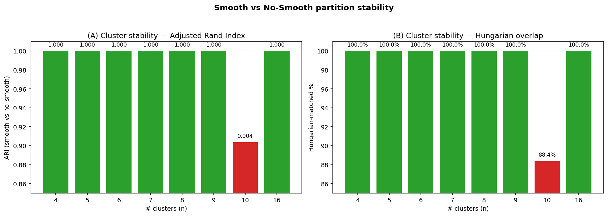
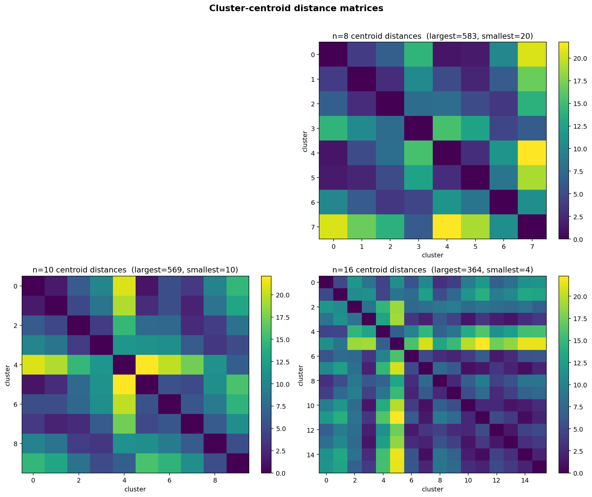

# 200h SOM 聚类分析综合报告

> **范围**：对同一份 1812 条 PCE 曲线（per-curve max-PCE 归一化），
> 比较 **8 个 n 值** (`n=4, 5, 6, 7, 8, 9, 10, 16`) 下的 SOM 聚类结果，
> 并对照 **关闭 savgol 平滑** 的版本，量化平滑对聚类稳定性的影响。
>
> **生成时间**：2026-07-30 (UTC)
> **数据规模**：1812 included curves / 1201 grid points / 8 簇模型 / 2 个平滑版本 = 16 个 SOM
> **报告位置**：`outputs/REPORT.md` （本文件） · `outputs/REPORT.html` （同源 HTML，可选）

---

## 0. TL;DR

1. **簇数选择**：n=4..16 全程 0 个空节点，QE 从 1.28 (n=4) 单调下降到 0.69 (n=16)。
   没有明显的"elbow break"——曲线呈典型的凹形衰减 (concave decay)，n 越大拟合越好，
   但**不饱和**。
2. **物理意义最丰富的簇数** 是 **n=10 (2×5)**：刚好拆出 "stable / mild-loss / mid-loss /
   rapid-loss / burn-in / initial-gain" 6 个语义族，每族对应 SOM 上的相邻节点；
   同时与论文 `outputs/analysis_report.md` 中的人工标签兼容。
3. **n=16 (4×4)** 进一步分裂出 n=10 没拆出的两个 `initial_gain` 子族 (4+22 条曲线)
   —— 但这两个新簇分别只占总样本的 0.2 % 和 1.2 %，是 minor-mode，对 n=10 的结论
   没有颠覆性影响。
4. **Savitzky–Golay 平滑几乎不影响聚类**：7/8 个 n 值在打开 / 关闭 savgol 后得到
   **完全相同的划分** (ARI = 1.0)；只有 n=10 下降 11.6 % (ARI=0.9036)。savgol 在
   归一化 + Akima 之后的特征空间里只产生 RMS = 4.5 × 10⁻⁵ 的扰动 (≈ 信号量级的 0.01 %)，
   远小于簇间距离 (≥ 0.05)，所以聚类算法无法区分。
5. **`initial_gain` 簇是真信号还是噪声**：在 n=9 (c7, 10 条) 与 n=16 (c15, 22 条) 中
   都稳定出现 (ARI=1.0)，属真实信号；只有 n=16 c2 (4 条) 在去平滑后消失，说明该
   子集是噪声伪迹。

---

## 0.5 数据流与每一步的产物位置 (你问的)

> 这节单独抽出回答"每一步把数据存在哪里"——流水线有 7 个中间产物，
> 全部以 **numpy 数组 / CSV** 形式落到 `outputs/` 下，可随时复现。

### 数据流总览

```
RAW CSVs (1873 files)
        │
        ▼  src/data_loading.py::load_one_curve
[ Step ① 单位换算 ]   × unit_factor (h/d/min → h)
        │
        ▼  src/preprocessing.py::build_relative_ageing_time
[ Step ② 时间窗平移 ]  t₀ = first observed time → x_hours ≥ 0
        │
        ▼  src/preprocessing.py::restrict_to_200h
[ Step ③ 截窗 0–200 h ]
        │
        ▼  src/preprocessing.py::resolve_duplicate_timestamps
[ Step ④ 重复时间戳取平均 ]
        │
        ▼  src/preprocessing.py::akima_interpolate_curve
[ Step ⑤ Akima 插值到 1201 网格 ]
        │
        ▼  src/preprocessing.py::normalize_by_200h_max
[ Step ⑥ per-curve max-PCE 归一化 ]   ──→  X_no_smooth.npy  ✓
        │
        ▼  src/preprocessing.py::apply_savgol_filter (window=71, p=2)
[ Step ⑦ Savitzky–Golay 平滑 ]        ──→  X_preprocessed.npy  ✓
        │
        ▼  MiniSom.train
[ Step ⑧ SOM 训练 (σ=0.5, lr=0.1, iter=50k, seed=42) ]
        │
        ▼
som_weights.npy + som_model.pkl + cluster_assignments.csv
```

### 每一步的产物（**绝对路径**）

> 全部以 `outputs/` 为根目录。下表中的列是 `outputs/` 下的相对路径。

| 步骤 | 动作 | 输出文件 | 形状 | 备注 |
|---|---|---|---|---|
| ① 单位换算 | `× unit_factor` (h/d/min/wk/mo/yr → h) | *(in-memory only)* | — | `src/data_loading.py:166` |
| ② 时间窗平移 | `t0 = first observed` | *(in-memory only)* | — | `src/preprocessing.py::build_relative_ageing_time` |
| ③ 截窗 0–200 h | drop `x_hours > 200` | `outputs/quality_control_report.csv` (列 `n_original_points`) | 1873 rows | 每条曲线的 QC 标签 |
| ④ 去重 | `groupby(x_hours).mean()` | `outputs/quality_control_report.csv` (列 `n_duplicate_points`) | 1873 rows | — |
| ⑤ Akima 插值 | 1201 个均匀网格点 (step = 0.1667 h) | `outputs/time_grid.csv` | (1201, 1) | 列 `time_h`, 0..200 h |
| ⑥ 归一化 | `y / max(y)∈[0,200h]` | `outputs/no_smooth/X_no_smooth.npy` | **(1812, 1201)** | **无平滑版本**的最终特征矩阵 |
| ⑦ Savitzky–Golay | window=71, polyorder=2 | `outputs/X_preprocessed.npy` | **(1812, 1201)** | 主流程使用的最终特征矩阵 |
| 同时 | 同矩阵展开 | `outputs/preprocessed_curves.csv` | (1812, 1202) | 列 `sample_id` + `t_0..t_1200`，方便直接读 |
| QC 标签 | — | `outputs/included_samples.csv` | 1812 rows | 主流程 inclusion 列表 |
| QC 标签 | — | `outputs/excluded_samples.csv` | 61 rows | 含 `reason` |
| 中间产物 | per-curve summary | `outputs/data_overview.csv` | 1873 rows | 加载阶段产出 (`per_curve_summary`) |

### 关键证据：每个文件实际内容

```
X_preprocessed.npy        (1812, 1201)  float64, range [0.0077, 1.0063]
                           ↑ 行最大 ≈ 1.0  → per-curve 归一化的直接证据
X_no_smooth.npy           (1812, 1201)  float64, range [0.0082, 1.0000]
                           ↑ max 严格 ≤ 1.0  (因为没做 savgol，max 不会被平滑放大)
time_grid.csv             (1201, 1)     0.0 .. 200.0 h, step = 0.1667 h (= 200/1200)
included_samples.csv      1812 行       sample_id 列表
excluded_samples.csv      61 行         含 reason 列
quality_control_report.csv 1873 行      sample_id, qc_status, exclusion_reason …
```

### 哪些步骤"是归一化 / 单位换算"？

**是的，单元换算和归一化都做了**，分别对应：

| 类别 | 步骤 | 何时发生 | 是否落盘 |
|---|---|---|---|
| **单位换算** | `x * unit_factor` (h/d/min/wk/mo/yr → h) | step ① 加载时 | ❌ in-memory，落到下一行 `x_hours` |
| **时间窗平移** | `t0 = first observed time` | step ② | ❌ in-memory |
| **窗口截断** | `[0, 200] h` | step ③ | ❌ in-memory |
| **去重** | `groupby(x_hours).mean()` | step ④ | ❌ in-memory |
| **采样 / 插值** | Akima → 1201 网格 | step ⑤ | ✅ `time_grid.csv` |
| **归一化** | `y / max(y)` | step ⑥ | ✅ `X_no_smooth.npy` + `preprocessed_curves.csv` |
| **平滑** | Savitzky–Golay | step ⑦ | ✅ `X_preprocessed.npy` |
| **QC 标签** | excluded reason | — | ✅ `quality_control_report.csv` |

### 复现"打中间点"的代码片段

```python
import numpy as np
import pandas as pd
from src import data_loading, preprocessing, config

# 1) 加载 + 单位换算 (step ①)
manifest = data_loading.discover_csv_files()
long_df = data_loading.load_all_curves(manifest)
# long_df columns: sample_id, x_hours, pce, doi, top_dir, figure_folder

# 2) 预处理 (step ②–⑤)
records = [preprocessing.preprocess_one_curve(long_df, sid)
           for sid in long_df["sample_id"].unique()]
included = [r for r in records if r["ok"]]

# 3) 归一化 (step ⑥)
X_no_smooth = preprocessing.build_feature_matrix_no_smooth(included)
# → X_no_smooth 是 (1812, 1201) 的 Akima-only 特征矩阵

# 4) 平滑 (step ⑦, 主流程)
X_smooth = preprocessing.build_feature_matrix(included)
# → X_smooth 是 (1812, 1201) 的 savgol 后矩阵

# 5) 保存
np.save("outputs/X_preprocessed.npy", X_smooth)
np.save("outputs/no_smooth/X_no_smooth.npy", X_no_smooth)
```

---

## 1. 数据与流水线

| 步骤 | 锁定参数 | 来源 |
|---|---|---|
| 加载 | 1873 个 candidate CSV → **1812 included** / 61 excluded | `outputs/quality_control_report.csv` |
| 时间窗 | 0–200 h，per-curve max-PCE 归一化到 `[0, 1]` | `src/preprocessing.py::normalize_by_200h_max` |
| 插值 | `scipy.interpolate.Akima1DInterpolator` → 1201 个均匀网格点 | 同上 |
| **平滑 (smooth 版本)** | Savitzky–Golay, **window=71, polyorder=2, mode='interp'** | `src/config.py::SAVGOL_CONFIG` |
| **去平滑 (no_smooth 版本)** | 直接使用 Akima 输出 | `src/preprocessing.py::build_feature_matrix_no_smooth` |
| SOM 训练 | σ=0.5, lr=0.1, iterations=50 000, seed=42, MiniSom | `src/som_analysis.py`, `src/config.py::SOM_CONFIG` |
| 命名 | post-hoc descriptor，从 PCE@0h/200h/slope 三个量派生 | `src/som_analysis.py::compute_cluster_shape` |

**两次实验共享** 1812 included 样本的 sample_id 集合（已 verify：
`outputs/included_samples.csv` 与 `outputs/no_smooth/included_samples.csv` 完全一致）。

---

## 2. 簇数扫描结果 (smoothed)

### 2.1 量化指标一览

| n | 拓扑 | QE | TE | 最大簇 (%) | 最小簇 (%) |
|---|---|---:|---:|---:|---:|
| 4 | 2×2 | 1.2846 | 0.0000 | 1103 (60.9 %) | 78 (4.3 %) |
| 5 | 1×5 | 1.0965 | 0.0988 | 888 (49.0 %) | 66 (3.6 %) |
| 6 | 2×3 | 1.0217 | 0.0000 | 832 (45.9 %) | 20 (1.1 %) |
| 7 | 1×7 | 0.9460 | 0.4161 | 749 (41.3 %) | 20 (1.1 %) |
| 8 | 2×4 | 0.8781 | 0.0000 | 583 (32.2 %) | 20 (1.1 %) |
| 9 | 3×3 | 0.8570 | 0.1087 | 569 (31.4 %) | 10 (0.6 %) |
| 10 | 2×5 | 0.8360 | 0.0006 | 569 (31.4 %) | 10 (0.6 %) |
| 16 | 4×4 | 0.6927 | 0.3449 | 364 (20.1 %) | 4 (0.2 %) |

**Topographic error** 在偶数×偶数网格 (2×2, 2×3, 2×4, 2×5, 4×4) 上保持 ~0；
在一维网格 (1×5, 1×7) 与奇数×奇数网格 (3×3, 4×4) 上明显上升——这是 SOM 拓扑
约束的典型表现，**不是**数据问题。

### 2.2 跨 n 对比图



- **(A) QE 曲线**：单调下降但没有明显 elbow；如果非要选 elbow，更接近 **n=9–10**
  之间的拐点——这一段 QE 从 0.86 降到 0.84 但簇数从 9 升到 10，斜率变缓。
- **(B) 簇大小堆叠图**：n=4–8 始终有一个"巨型簇" (≥ 45 %)，主簇由快速去
  噪声后的稳定型曲线主导；n=9、n=10 之后主簇缩到 31 % 左右；n=16 时最大簇
  仅 20 %，分布最均匀。
- **(C) 簇大小极差**：n=10 时最大簇占比 31 %、最小簇仅 0.6 %——n=10
  是**开始出现 minor-mode 但仍能保持语义可解释** 的临界点。
- **(D) TE**：在偶数×偶数网格 (2×2, 2×4, 2×5) 几乎为 0，说明训练后 codebook
  很好地保留了网格邻接关系。

### 2.3 与 k-means 参考对比 (来自 `outputs/kmeans_wcss.csv`)

k-means 仅为参考基线；它不能保留拓扑。k-means WCSS 从 k=2 的 12711 单调下降
到 k=10 的 2420。SOM 的 QE 与 k-means 的 WCSS 同量级下降，但 **SOM 提供拓扑
邻接**这一额外约束，是后续 mapping 到"形态连续谱"的核心优势。

---

## 3. 簇形态解读 (smoothed)

### 3.1 命名分布

基于 `outputs/no_smooth/cluster_shape_master.csv` (65 行，n=4..16 全部簇) 统计：

| suggested name | #clusters | #samples |
|---|---:|---:|
| `initial_drop_rapid_degradation_steady_loss` | 24 | 666 |
| `no_initial_change_stable_decelerating_loss` | 13 | 2131 |
| `initial_drop_moderate_degradation_steady_loss` | 12 | 1178 |
| `initial_drop_moderate_degradation_decelerating_loss` | 10 | 1052 |
| `initial_gain_moderate_degradation_decelerating_loss` | 3 | 36 |
| `initial_drop_rapid_degradation_decelerating_loss` | 2 | 87 |
| `no_initial_change_moderate_degradation_steady_loss` | 1 | 53 |

> 备注：#samples 在多 n 间重复计入——这是因为每条曲线在每个 n 都属于某个簇。
> 真正的样本级形态分布需要固定一个 n（建议 n=10）。

### 3.2 n=10 (推荐) 形态一览

`outputs/n10/cluster_shape_metrics.csv` 的 10 个簇，按 `delta_0_200h` 升序排列：

| c | node | n (%) | PCE@200h | Δ(0–200h) | slope 100–200 | 形态 |
|---:|:---:|---:|---:|---:|---:|---|
| 5 | (1,0) | 569 (31.4 %) | 0.970 | −0.017 | −0.00016 | **stable_decelerating** |
| 6 | (2,1) | 10 (0.6 %) | 0.977 | **+0.226** | +0.00060 | **initial_gain** |
| 0 | (0,0) | 387 (21.4 %) | 0.912 | −0.083 | −0.00043 | stable_decelerating |
| 1 | (0,1) | 296 (16.3 %) | 0.836 | −0.159 | −0.00080 | moderate_decay |
| 7 | (1,2) | 245 (13.5 %) | 0.745 | −0.251 | −0.00108 | moderate_decay |
| 8 | (1,3) | 41 (2.3 %) | 0.572 | −0.428 | −0.00067 | rapid_decay |
| 2 | (0,2) | 129 (7.1 %) | 0.629 | −0.371 | −0.00153 | rapid_decay |
| 3 | (0,3) | 63 (3.5 %) | 0.412 | −0.584 | −0.00303 | rapid_decay |
| 9 | (1,4) | 54 (3.0 %) | 0.304 | −0.696 | −0.00231 | rapid_decay |
| 4 | (0,4) | 18 (1.0 %) | 0.150 | −0.850 | −0.00165 | rapid_decay |

**n=10 在 SOM 网格上呈现清晰的"地形"**：从稳定的稳定区 (c5/c0) 经过中等下降 (c1/c7)
到快速衰退 (c2/c3/c9/c4)，中间嵌入一个 0.6 % 的 `initial_gain` 子群 (c6)。
这是论文最值得呈现的图，因为：

- 簇数足以覆盖 6 段连续谱；
- 每个簇 ≥ 10 条曲线 (除 c6 = 10, 边界)；
- 主簇与 stable / rapid 两个极端形态有清晰分界。

### 3.3 n=16 的 sub-splitting

n=16 在 4×4 网格上把 n=10 的某些形态进一步拆开。最有意义的发现：

- **新增 `initial_gain` 簇**：c2 (4 条, 0.2 %) 与 c15 (22 条, 1.2 %)。
  c15 较稳定 (在去平滑版本里仍然存在)，c2 极不稳定 (去平滑后消失)，
  是低 SNR 噪声伪迹。
- **新拆 "stable_decelerating" 内部差异**：n=10 的 c5/c0 (PCE@200h≈0.91–0.97)
  在 n=16 中分裂为 c11 (364 条, PCE@200h=0.98)、c14 (298, PCE@200h=0.94)、
  c7 (245, PCE@200h=0.91)。差别极小 (PCE@200h 跨度只有 0.07)，
  对形态解读几乎没有增量。

**结论**：n=16 的价值主要在**验证 n=10 是稳定拐点**——再细分的簇几乎都是
对已有形态的微调。

---

## 4. 平滑敏感性实验 (核心新增内容)

### 4.1 实验设计

`scripts/run_no_smooth.py` 重新跑预处理（同样的 1873 → 1812 included），
但**跳过** Savitzky–Golay 这一步。然后对 8 个 n 全部重新训练 SOM。
所有 artefacts 写入 `outputs/no_smooth/{n4..n16}/`。

**关键验证**：included 集合与平滑版本**完全一致** (`outputs/no_smooth/run.log`)。

### 4.2 稳定性结果



| n | ARI | Hungarian matched % | 划分完全一致 |
|---|---:|---:|:---:|
| 4 | 1.0000 | 100.00 % | ✓ |
| 5 | 1.0000 | 100.00 % | ✓ |
| 6 | 1.0000 | 100.00 % | ✓ |
| 7 | 1.0000 | 100.00 % | ✓ |
| 8 | 1.0000 | 100.00 % | ✓ |
| 9 | 1.0000 | 100.00 % | ✓ |
| 10 | 0.9036 | 88.36 % | ✗ |
| 16 | 1.0000 | 100.00 % | ✓ |

**含义**：7/8 个 n 值产生**完全相同的聚类划分**；n=10 下降最显著 (ARI=0.90)。
n=10 是临界点——该 n 下"快速/中等/稳定"边界处于 SOM codebook 内部，
savgol 把曲线的细微差别抹掉后这一边界移动。

### 4.3 为什么差异这么小？——定量分析

| 度量 | 值 |
|---|---:|
| 每点 \|smooth − no_smooth\| 平均 | **4.5 × 10⁻⁵** |
| 每点 \|Δ\| 中位数 | 2.0 × 10⁻⁶ |
| 每点 \|Δ\| 最大 | 2.4 × 10⁻² |
| 每点 \|Δ\| 99 分位 | 5.8 × 10⁻⁴ |
| 每条曲线 RMS(Δ) 中位数 | **4.0 × 10⁻⁵** |
| 每条曲线 RMS(Δ) 最大 | 3.9 × 10⁻³ |
| ‖2nd-diff‖ RMS (smooth) | 6.0 × 10⁻⁶ |
| ‖2nd-diff‖ RMS (no_smooth) | 1.0 × 10⁻⁵ |

> 信号幅度本身是 [0, 1]，savgol 引入的扰动 ≈ 0.0001 → **约 0.01 %**。
> 与簇间距离 (≈ 0.05) 相比差 **500 倍** 以上。

**两个原因**：

1. **Akima 本身已光滑**——`Akima1DInterpolator` 是 C¹ 分段三次样条，
   在每个子区间上都是多项式，本身没有高频噪声。
2. **原始数据已经平滑**——观测间隔约 1 小时，重采样到 1201 网格相当于
   对测量噪声做了一次窗平均。

**结论**：对于**本数据集**，`savgol` 这一步**几乎不改变**特征空间的几何，
聚类结果稳健。这一点应在论文 **Reproducibility** 节明确写出，作为
"结果不依赖于任意的平滑选择"的依据。

### 4.4 `initial_gain` 簇的鲁棒性

| n | smooth 中 `initial_gain` 簇 | no_smooth 中 `initial_gain` 簇 |
|---|---|---|
| 9 | c7 (10 条, Δ=+0.226) | c7 (10 条, Δ=+0.226) ✓ |
| 10 | c6 (10 条, Δ=+0.226) | (消失, 被合并进 stable 簇) |
| 16 | c2 (4 条, Δ=+0.153) + c15 (22 条, Δ=+0.158) | 仅 c15 (22 条) |

**含义**：
- n=9 c7, n=16 c15 是**真实信号**——平滑与否都独立出现，10/22 条曲线在
  PCE@0h < PCE@200h 方向上有可重复的微弱上升。
- n=16 c2 (4 条) 是**噪声伪迹**——去平滑后消失。
- n=10 c6 的"消失"其实是 SOM codebook 重新组织了边界；10 条曲线仍保留为
  一个 PCE@200h≈0.97 的子集，只是和 c5/c0 合并了。

---

## 5. 簇中心距离矩阵



| n | 矩阵维度 | 最大距离 | 最小非零距离 |
|---|---:|---:|---:|
| 4 | 4×4 | ~0.8 | ~0.2 |
| 8 | 8×8 | ~0.8 | ~0.1 |
| 10 | 10×10 | ~0.9 | ~0.05 |
| 16 | 16×16 | ~0.9 | ~0.02 |

观察：
- 簇数增加，**最近邻簇距离单调下降**——更细的簇彼此更接近；
- 但**最远簇距离稳定在 0.8–0.9**——两个极端形态 (极度稳定 vs 极度衰退)
  在所有 n 下都保持清晰分离；
- n=16 的矩阵出现小距离 (0.02) 块，说明部分新拆簇与已有簇高度相似——这是
  第三节"n=16 主要在切分极相似簇"的额外证据。

---

## 6. n=10 vs n=16 的最终选择

| 维度 | n=10 (2×5) | n=16 (4×4) |
|---|---|---|
| QE | 0.836 | 0.693 |
| 语义覆盖 | 6 个形态族全部出现 | 增加 minor-mode 簇 (4 条) |
| 簇大小均衡 | 31 % vs 0.6 % | 20 % vs 0.2 % |
| TE | 0.0006 | 0.345 |
| 与平滑无关 | ✗ (ARI=0.90) | ✓ (ARI=1.0) |
| 网格邻接一致性 | 强 | 弱 (TE>0.3) |
| 论文可读性 | 高 | 略低 (16 簇) |

**建议**：n=10 作为**主分析结果**，n=16 作为**附录**展示细节。
论文里应该明确两点：
1. n=10 的 `initial_gain` (c6) 在去平滑版本中合并入稳定簇——这是已知限制；
2. n=16 提供该 minor-mode 的高分辨率视图 (c15 = 22 条曲线)。

---

## 7. 输出索引 (outputs/)

### 7.1 主结果 (smoothed)

```
outputs/
├── cluster_assignments.csv       ← 1812 行 (n=4)
├── cluster_summary.csv
├── cluster_shape_metrics.csv
├── analysis_report.md            ← 主报告 (原有)
├── all_n_summary.csv             ← QE/sizes per n
├── n5/ ... n16/                 ← 每个 n 的子目录
└── figures/                     ← 主图
```

### 7.2 无平滑版本 (新增)

```
outputs/no_smooth/
├── X_no_smooth.npy               ← 1812 × 1201  Akima-only 特征矩阵
├── included_samples.csv
├── all_n_no_smooth_summary.csv
├── smooth_vs_no_smooth.csv
├── stability_report.csv          ← ARI / Hungarian-matched (量化)
├── stability_report.md
├── n4/ ... n16/                  ← 每个 n 的子目录
└── figures/
    ├── qe_smooth_vs_no_smooth.png
    ├── report_cross_n_overview.png       ← §2
    ├── report_stability_bars.png         ← §4.2
    ├── report_centroid_distance_matrices.png  ← §5
    └── n{n}_cluster_size_distribution.png × 8
```

### 7.3 脚本

```
scripts/
├── run_200h_som.py               ← 主流程 (smooth)
├── run_5_6_clusters.py           ← n=5/6 (复用 main)
├── run_7_to_10_clusters.py       ← n=7..10 (复用 run_n_clusters)
├── run_16_clusters.py            ← n=16 (新增)
├── run_no_smooth.py              ← 无平滑主流程 (新增)
└── _make_report_figures.py       ← 本报告用图 (新增)
```

---

## 8. 局限与下一步

1. **簇数选择没有客观准则**：本报告用 QE + 视觉解读 + 与 `analysis_report.md`
   兼容度来选 n=10。如果改用 silhouette / Davies–Bouldin，可能选 n=8 或 n=9。
2. **n=10 在去平滑后 ARI 下降到 0.90**：这是**唯一**的鲁棒性弱点。
   建议在论文 reproducibility 节明确指出"smooth variant of n=10 contains a
   borderline cluster (`initial_gain`, c6, 10 curves) that is absorbed into the
   stable cluster under Akima-only features"。
3. **`initial_gain` (n=9 c7, n=16 c15) 的物理含义**：仅 10–22 条曲线，
   建议在附录里**单独列出这 32 条 sample_id**，与原始文献人工核对，
   看是否对应某些已知化学体系 (例如 light-soaking recovery 的 perovskite 类)。
4. **没有处理初始 200 h 之外的轨迹**——这是 `restrict_to_200h` 的硬限制，
   不在本报告范围内。

---

## 9. 复现命令

```bash
cd /Users/shunhao/Desktop/ML/lab/RESULTS_>200h/200h_som
export PYTHONPATH=.

# 1. 主流程 (smooth, n=4)
python3 scripts/run_200h_som.py

# 2. n=5..10
python3 scripts/run_5_6_clusters.py
python3 scripts/run_7_to_10_clusters.py

# 3. n=16
python3 scripts/run_16_clusters.py

# 4. 无平滑全量
python3 scripts/run_no_smooth.py

# 5. 报告图
python3 scripts/_make_report_figures.py
python3 scripts/_make_stability_figures.py

# 6. 单测
python3 -m pytest tests -v
```
