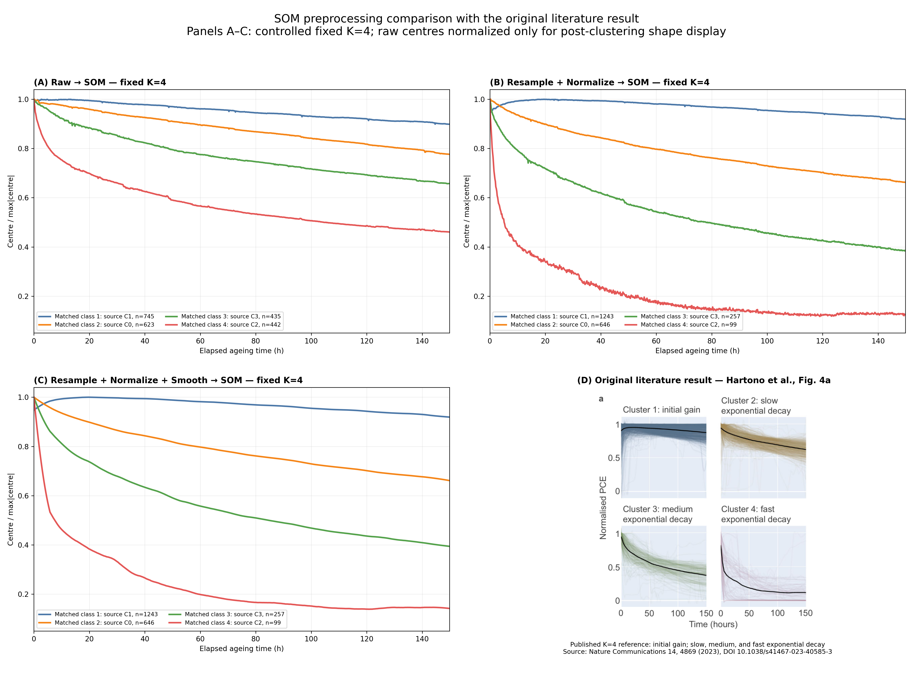
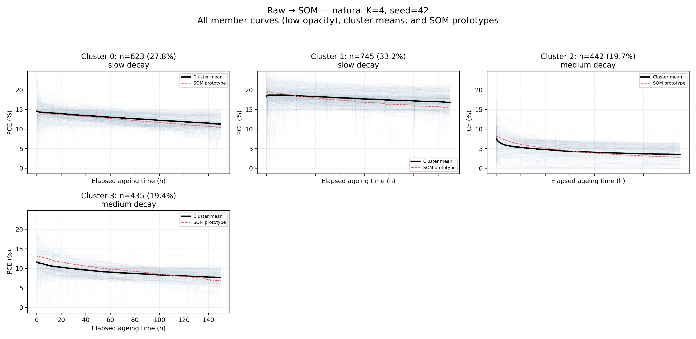
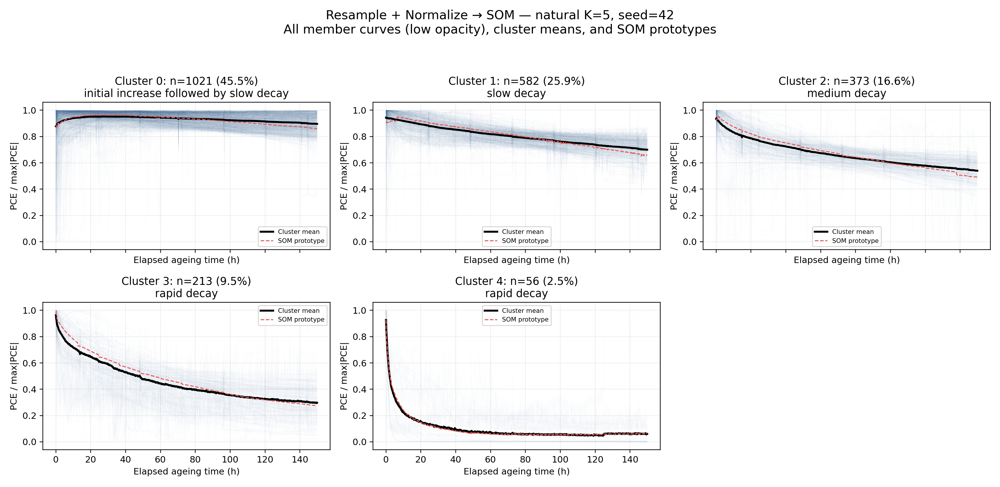
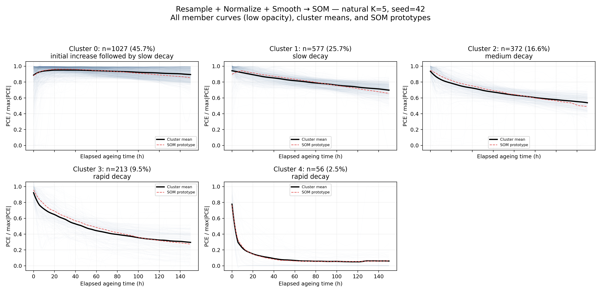

# Hartono 数据集：三种 SOM 预处理管线对比

## 1. 实验目标

本实验只比较预处理强度对 SOM 聚类的影响，不复现论文作为第四条管线，也不为了得到特定形态而调参。核心问题是：相同 2,245 条 Hartono PSC ageing curves 在 raw、重采样+MaxAbs、重采样+MaxAbs+Savitzky–Golay 三种输入下，是否保留相同的主要退化趋势。

## 2. 三条管线的精确定义

1. **Raw → SOM**：直接使用 Zenodo 发布的 `MPPT_EFF` 数值，不增加重采样、插值、归一化、平滑、导数或工程特征。
2. **Resample + Normalize → SOM**：统一到 10 min、0–149.833 h 的 elapsed-time 网格，必要时使用 Akima，再按每条曲线在窗口内的 `max|PCE|` 归一化。本数据已经在该网格且没有缺失值，因此重采样和 Akima 是经审计的恒等步骤；数值变化来自 MaxAbs。
3. **Resample + Normalize + Smooth → SOM**：在管线 2 后使用 Savitzky–Golay，`window_length=71`、`polyorder=2`。

三者统一使用 MiniSom、矩形网格、欧氏距离、样本权重初始化、`sigma=0.5`、`learning_rate=0.1`、50,000 次顺序训练和主种子 42。候选 K 的网格由同一最接近方形的精确因子规则生成；K=4 即 2×2。

## 3. 数据集与样本数

- 来源：Hartono et al. Zenodo record 8185883，文件 `20230303_mySeriesDrop.pkl`。
- SHA-256：`217867a67eb7f5ac9481ca81eea00326578e62c1441be31f791654ed6a4f1a18`。
- 样本数：2,245。
- 每条曲线：900 点；10 min 间隔；实际坐标 0–149.833 h，对应名义 150 h 窗口。
- 所有值有限、所有向量等长；三个测试使用相同样本、顺序与时间窗。

## 4. Raw → SOM 的不可避免限制

Zenodo 发布的是已清洗并排列为 900 个连续 10 min 点的曲线。Test 1 直接使用这些发布的 PCE 值，不再增加重采样、插值、归一化或平滑；因此它不是仪器级 raw JSON 分析。 因为发布数据可直接构成等长向量，本实验仍标为 **Raw SOM**，而不是 Near-Raw SOM；但不能把它描述成未经发布者清洗的仪器原始数据。

## 5. 各管线的自然 K

自然 K 只用 K=2…8 的 SOM quantization error 决定：先对每条 QE 曲线 min–max 归一化，再取其相对端点连线的最大垂直偏离（几何 elbow）。该规则在查看 Bridge/Hill/Slope/Valley 之前冻结。

### Raw → SOM

| k | quantization_error | normalized_chord_elbow_score | selected |
| --- | --- | --- | --- |
| 2 | 110.9542 | 0.0000 | False |
| 3 | 66.5033 | 0.4378 | False |
| 4 | 54.0714 | 0.4402 | True |
| 5 | 46.6644 | 0.3742 | False |
| 6 | 44.0432 | 0.2432 | False |
| 7 | 39.8235 | 0.1339 | False |
| 8 | 37.4151 | 0.0000 | False |
### Resample + Normalize → SOM

| k | quantization_error | normalized_chord_elbow_score | selected |
| --- | --- | --- | --- |
| 2 | 3.4943 | 0.0000 | False |
| 3 | 2.8082 | 0.2066 | False |
| 4 | 2.4543 | 0.2325 | False |
| 5 | 2.0020 | 0.3119 | True |
| 6 | 1.8624 | 0.2212 | False |
| 7 | 1.7050 | 0.1402 | False |
| 8 | 1.6563 | 0.0000 | False |
### Resample + Normalize + Smooth → SOM

| k | quantization_error | normalized_chord_elbow_score | selected |
| --- | --- | --- | --- |
| 2 | 3.4654 | 0.0000 | False |
| 3 | 2.7735 | 0.2071 | False |
| 4 | 2.4188 | 0.2320 | False |
| 5 | 1.9720 | 0.3067 | True |
| 6 | 1.8234 | 0.2203 | False |
| 7 | 1.7912 | 0.0710 | False |
| 8 | 1.6142 | 0.0000 | False |

选择结果：Raw K=4；Resample+Normalize K=5；Resample+Normalize+Smooth K=5。

## 6. 固定 K=4 与原文献结果对照

图中 (A)–(C) 是本实验三条管线的固定 K=4 受控比较，(D) 直接引用本地论文 PDF 的 Fig. 4a，展示文献报告的 initial gain、slow/medium/fast exponential decay 四类。文献面板只作视觉参照，不进入训练、K 选择或 ARI/NMI 计算。固定 K=4 不证明四个自然簇；本实验三组均使用 2×2 SOM 和主种子 42。标签本身没有语义，比较使用 ARI/NMI；中心显示前通过 Hungarian assignment 按自身最大值归一化后的形状匹配。

## 7. Test 1 — Raw → SOM

自然 K=4。诊断结果为 **mainly absolute PCE magnitude**。绝对量级解释率：初始 PCE η²=0.500、最大 PCE η²=0.693；形状指标解释率：总相对变化 η²=0.134、早期斜率 η²=0.091、晚期斜率 η²=0.025。因此结论不是依据肉眼给出的。

## 8. Test 2 — Resample + Normalize → SOM

自然 K=5。诊断结果为 **mainly degradation tendency / shape**。去掉绝对幅值后，固定 K=4 相对 Raw 的 ARI=0.157、NMI=0.177，说明成员边界的变化幅度可量化而非仅是坐标尺度变化。簇内自身最大值归一化形状 RMSE 从 Raw 标签下的 0.1310 变为 0.0640。

## 9. Test 3 — Resample + Normalize + Smooth → SOM

自然 K=5。平滑后的固定 K=4 成员关系与未平滑归一化结果高度一致，主要作用是压低局部噪声。 固定 K=4 相对 Test 2 的 ARI=1.000、NMI=1.000；自然 K=5 视图在最佳标签对齐后只有 7 / 2245 条换簇（ARI=0.990、NMI=0.986）。平滑只作用于 SOM 输入的第三条管线；报告中的统一 SG 形态度量是训练完成后的描述算子，不回流训练。

## 10. ARI / NMI 比较

| comparison | ARI | NMI |
| --- | --- | --- |
| Test 1 vs Test 2 | 0.1566 | 0.1774 |
| Test 2 vs Test 3 | 1.0000 | 1.0000 |
| Test 1 vs Test 3 | 0.1566 | 0.1774 |

Test 1 vs Test 3 的 ARI=0.157、NMI=0.177。这些指标对任意簇 ID 置换不变。

## 11. 簇中心形态比较

`comparison/cluster_shape_features.csv` 保存自然 K 与固定 K=4 的早/晚斜率、总变化、极值时间、主要转折点、峰到终点下降、谷深和恢复幅度。`comparison/fixed_k4_center_matching.csv` 保存跨管线中心匹配、Pearson 形状相关和 RMSE。固定视图相对 Test 2 的平均中心相关分别为 Raw=0.970、Smooth=0.999。

## 12. 重采样 + 归一化的影响

本发布数据不需要数值重采样或 Akima 补点，所以 Test 1→2 的可识别变化来自 MaxAbs。Raw 的主分割诊断为“mainly absolute PCE magnitude”，归一化后为“mainly degradation tendency / shape”。固定 K=4 的 ARI/NMI 和 η² 指标共同判断归一化是否把 SOM 从绝对 PCE 分割转向退化趋势分割。

## 13. 平滑的附加影响

平滑后的固定 K=4 成员关系与未平滑归一化结果高度一致，主要作用是压低局部噪声。 自然 K=5 仅 7 条换簇，5 个中心的主要 turning-point 计数均保持不变；主要轮廓（初始增益、慢/中/快衰减）没有合并或消失。快速衰减中心的早期陡降被 SG 圆滑化，细小谷深与恢复幅度略有变化，详见 `cluster_shape_features.csv`，但没有产生新的主要峰谷类型。

## 14. 随机种子稳健性

主种子之外，每条管线用 0–9 共 10 个重复种子，所有其他设置不变。中心形态通过最小 RMSE 匹配后计算 Pearson 相关。

| Test | Selected K | QE mean | QE SD | Mean ARI vs seed 42 | Mean NMI vs seed 42 | Mean matched-centre r | Shapes persist |
| --- | --- | --- | --- | --- | --- | --- | --- |
| test1_raw | 4 | 54.0714 | 0.0000 | 1.0000 | 1.0000 | 1.0000 | True |
| test2_resample_normalize | 5 | 2.0020 | 0.0000 | 1.0000 | 1.0000 | 1.0000 | True |
| test3_resample_normalize_smooth | 5 | 1.9720 | 0.0000 | 1.0000 | 1.0000 | 1.0000 | True |

“Shapes persist” 的可复现判据为平均 matched-centre r≥0.90 且平均 NMI≥0.70；它只用于总结，不用于挑选种子。

## 15. Bridge / Hill / Slope / Valley 事后观察

该核查发生在全部模型和 K 冻结之后。名称只是 operational shape resemblance，不是论文正式标签或训练目标。

| test | archetype | status | matching_clusters |
| --- | --- | --- | --- |
| test1_raw | Bridge | Not observed |  |
| test1_raw | Hill | Not observed |  |
| test1_raw | Slope | Clearly present | 0;1;2;3 |
| test1_raw | Valley | Not observed |  |
| test2_resample_normalize | Bridge | Clearly present | 0 |
| test2_resample_normalize | Hill | Not observed |  |
| test2_resample_normalize | Slope | Clearly present | 1;2;3 |
| test2_resample_normalize | Valley | Not observed |  |
| test3_resample_normalize_smooth | Bridge | Clearly present | 0 |
| test3_resample_normalize_smooth | Hill | Not observed |  |
| test3_resample_normalize_smooth | Slope | Clearly present | 1;2;3 |
| test3_resample_normalize_smooth | Valley | Not observed |  |

## 16. 最终结论

**B. Moderately robust — 主要趋势可辨认，但预处理改变了簇边界或群体比例。**

对问题的直接回答是：三条管线并非简单地产生完全相同的聚类。归一化移除绝对 PCE 后会改变 SOM 的距离结构与成员边界；随后 SG 平滑的附加效应由 Test 2→3 的 ARI/NMI 显示。主要退化轮廓能否称为保留，以固定 K=4 中心相关和种子稳健性为依据，而不是强行把结果解释为四种指定形态。

## 汇总表

| Test | Pipeline | Selected K | Main cluster tendencies | Main interpretation |
| --- | --- | --- | --- | --- |
| Test 1 | Raw → SOM | 4 | C0 slow decay (27.8%); C1 slow decay (33.2%); C2 medium decay (19.7%); C3 medium decay (19.4%) | mainly absolute PCE magnitude |
| Test 2 | Resample + Normalize → SOM | 5 | C0 initial increase followed by slow decay (45.5%); C1 slow decay (25.9%); C2 medium decay (16.6%); C3 rapid decay (9.5%); C4 rapid decay (2.5%) | mainly degradation tendency / shape |
| Test 3 | Resample + Normalize + Smooth → SOM | 5 | C0 initial increase followed by slow decay (45.7%); C1 slow decay (25.7%); C2 medium decay (16.6%); C3 rapid decay (9.5%); C4 rapid decay (2.5%) | mainly degradation tendency / shape |

## 簇级表

| Test | cluster | n | fraction | qualitative_morphology | key_shape_features |
| --- | --- | --- | --- | --- | --- |
| test1_raw | 0 | 623 | 0.2775 | slow decay | Δrel=-0.221; early slope=-0.0018/h; late slope=-0.0013/h; turns=0 |
| test1_raw | 1 | 745 | 0.3318 | slow decay | Δrel=-0.094; early slope=-0.0003/h; late slope=-0.0006/h; turns=1 |
| test1_raw | 2 | 442 | 0.1969 | medium decay | Δrel=-0.505; early slope=-0.0079/h; late slope=-0.0008/h; turns=0 |
| test1_raw | 3 | 435 | 0.1938 | medium decay | Δrel=-0.339; early slope=-0.0045/h; late slope=-0.0012/h; turns=0 |
| test2_resample_normalize | 0 | 1021 | 0.4548 | initial increase followed by slow decay | Δrel=0.009; early slope=0.0017/h; late slope=-0.0006/h; turns=1 |
| test2_resample_normalize | 1 | 582 | 0.2592 | slow decay | Δrel=-0.259; early slope=-0.0026/h; late slope=-0.0013/h; turns=0 |
| test2_resample_normalize | 2 | 373 | 0.1661 | medium decay | Δrel=-0.423; early slope=-0.0060/h; late slope=-0.0013/h; turns=0 |
| test2_resample_normalize | 3 | 213 | 0.0949 | rapid decay | Δrel=-0.650; early slope=-0.0096/h; late slope=-0.0010/h; turns=0 |
| test2_resample_normalize | 4 | 56 | 0.0249 | rapid decay | Δrel=-0.775; early slope=-0.0156/h; late slope=0.0003/h; turns=0 |
| test3_resample_normalize_smooth | 0 | 1027 | 0.4575 | initial increase followed by slow decay | Δrel=0.007; early slope=0.0017/h; late slope=-0.0006/h; turns=1 |
| test3_resample_normalize_smooth | 1 | 577 | 0.2570 | slow decay | Δrel=-0.260; early slope=-0.0027/h; late slope=-0.0013/h; turns=0 |
| test3_resample_normalize_smooth | 2 | 372 | 0.1657 | medium decay | Δrel=-0.424; early slope=-0.0060/h; late slope=-0.0013/h; turns=0 |
| test3_resample_normalize_smooth | 3 | 213 | 0.0949 | rapid decay | Δrel=-0.676; early slope=-0.0100/h; late slope=-0.0011/h; turns=0 |
| test3_resample_normalize_smooth | 4 | 56 | 0.0249 | rapid decay | Δrel=-0.902; early slope=-0.0187/h; late slope=0.0003/h; turns=0 |

## 可复现性说明

- 执行脚本：`../run_som_preprocessing_comparison.py`
- 参数：`configuration.json`
- 数据审计：`data_audit.json`
- 软件版本：`software_versions.json`
- 文件清单与校验：`checksums.sha256`
- 固定 K=4 assignment、自然 K assignment、中心、QE 和逐种子结果均以 CSV/NPY 保存。
